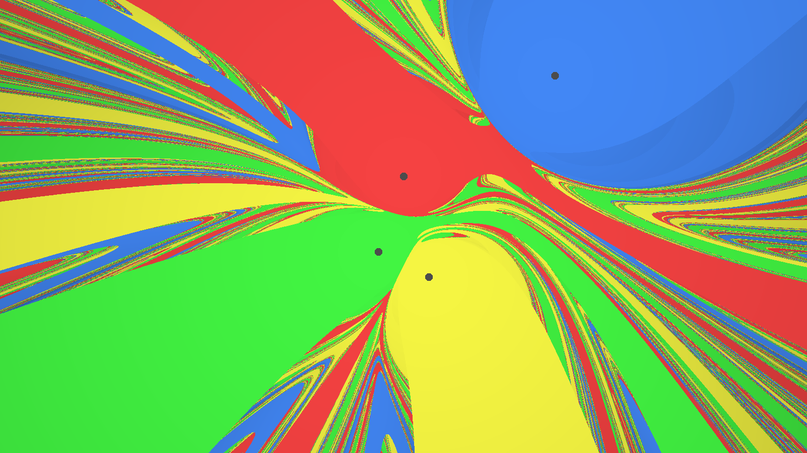

<div style='text-align: center'>
output with 1600x900 image resolution
</div>

# Usage

Requires `make`, `feh` image viewer, and `g++` (C++23.)

Run make in this directory:
```shell
make
```
<br>

# ODE details

Model an object orbiting a planet by

$$\mathbf{x}'' = - k \frac{\mathbf{x}}{|\mathbf{x}|^3} - c\mathbf{x}'$$

$\mathbf{x}(t)$ is a vector function indicating position relative to planet at time $t$

$k$ is strength of gravity

$c$ is drag.

---

Extending to multiple planets

$$\mathbf{x}'' = -\sum_{i} k_i\frac{\mathbf{x}-\mathbf{r}_i}{\big|\mathbf{x}-\mathbf{r}_i\big|^3} - c\mathbf{x}'$$

$\mathbf{x}(t)$ is absolute position

$\mathbf{r}_i$ is the position of the $i$-th planet.

